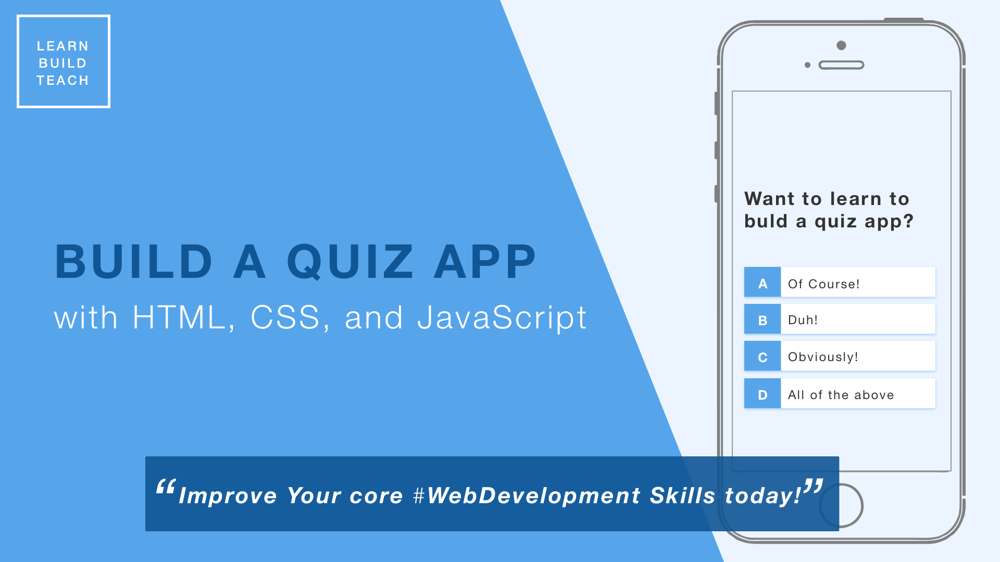

# Build a Quiz App with HTML, CSS, and JavaScript

Build a Quiz App with HTML, CSS, and JavaScript to improve your Core Web Development

Want to improve your **core Web Develoment skills**? Want to improve your knowledge of **HTML, CSS, and JavaScript**? In this course, you're going to learn how to build a Quiz application **without the assistance of libraries or frameworks**. Here are some of the topic we will cover!

-   Save high scores in Local Storage
-   Create a progress bar
-   Create a spinning loader icon
-   Dynamically generate HTML in JavaScript
-   Fetch trivia questions from Open Trivia DB API

-   JavaScript - Array Functions (splice, map, sort), Local Storage, Fetch API
-   ES6 JavaScript Features - Arrow Functions, the Spread Operator, Const and Let, Template Literals
-   CSS - Flexbox, Animtations, and REM units

## Course Intro and Resources

Welcome to "Build a Quiz App with HTML, CSS, and JS". I'm so excited you decided to take the initiative to improve your core Web Development skills!

In this course, we are going to use fundamental HTML, CSS, and JavaScript skills to build a quiz application. This application will be able to load questions from a 3rd party API, track and display high scores, and so much more! You'll learn how to use Local Storage, create animations, use modern ES6 JavaScript features, and more.

Resources

-   [Course Source Code](https://github.com/jamesqquick/Design-And-Build-A-Quiz-App)
-   [Learn Build Teach Newsletter](https://www.learnbuildteach.com/)
-   [Learn Build Teach YouTube Channel](https://www.youtube.com/c/jamesqquick)

## 1. Create and Style the Home Page

In this video, we are going to create the home page along with a good chunk of the necessary CSS. The home page will consist of a few links for the Game and High Scores pages. We will also create helper CSS classes for Flexbox, buttons, and hiding elements.

I encourage you all to take a look at Emmet snippets for generating HTML and CSS.

Resources

-   [Emmet in Visual Studio Code](https://www.youtube.com/watch?v=5guZjNDcVnA)
-   [Understanding REM Units](https://www.sitepoint.com/understanding-and-using-rem-units-in-css/)
-   [A Complete Guide to Flexbox](https://css-tricks.com/snippets/css/a-guide-to-flexbox/)

## 2. Create and Style the Game Page

In this video, we will create the Game Page and display static question and answer information. Eventually, we will load questions from an API, but for now, we will hard code one question so to establish styling.

## 3. Display Hard Coded Question and Answers

In this video, we will load questions from a hard coded array and iterate through available questions as the use answers them. We will use custom data attributes, the ES6 spread operator, and JavaScript arrow functions.

Resources

-   [Creating Code Snippets in Visual Studio Code](https://www.youtube.com/watch?v=K3gLlZm-m_8)
-   [Using Data Attributes](https://developer.mozilla.org/en-US/docs/Learn/HTML/Howto/Use_data_attributes)
-   [Document Query Selector](https://developer.mozilla.org/en-US/docs/Web/API/Document_object_model/Locating_DOM_elements_using_selectors)
-   [Document Get by ID](https://developer.mozilla.org/en-US/docs/Web/API/Document/getElementById)
-   [Spread Operator](https://developer.mozilla.org/en-US/docs/Web/JavaScript/Reference/Operators/Spread_syntax)
-   [Arrow Functions](https://developer.mozilla.org/en-US/docs/Web/JavaScript/Reference/Functions/Arrow_functions)

## 4. Display Feedback for Correct/Incorrect Answers

In this video, we check the user's answer for correctness and display feedback to the user before loading the next question.

Resources

-   [Bootstrap 4 Colors](https://www.w3schools.com/bootstrap4/bootstrap_colors.asp)
-   [Triple vs Double Equals](https://codeburst.io/javascript-double-equals-vs-triple-equals-61d4ce5a121a)

## 5. Create Head's Up Display (HUD)

In this video, we will create a Heads Up Display (HUD) for our quiz app. This will display the user's score and current question number.

Resources

-   [ES6 Template Literals](https://developer.mozilla.org/en-US/docs/Web/JavaScript/Reference/Template_literals)

## 6. Create a Progress Bar

In this video, we will take our HUD one step further by creating a visual progress bar to track the user's progress through the questions.

## 7. Create and Style the End Page

In this video, we will create our End page where we will display the user's achieved score. This screen will provide a form for saving the score and links for playing again or going home.

Resources

-   [Local Storage](https://www.w3schools.com/jsref/prop_win_localstorage.asp)

## 8. Save High Scores in Local Storage

In this video, we will save and maintain a high scores array in Local Storage. To do this, we will need to JSON.stringify() and JSON.parse() to convert our high score array to a string and visa versa.

Resources

-   [Local Storage](https://www.w3schools.com/jsref/prop_win_localstorage.asp)

## 9. Load and Display High Scores from Local Storage

In this video, we will create our High Scores page. We will have to load the high scores from Local Storage, iterate through them, and display them on the screen.

Resources

-   [JSON Parse and Stringify](https://alligator.io/js/json-parse-stringify/)
-   [Array Sort](https://www.w3schools.com/js/js_array_sort.asp)
-   [Array Map](https://www.w3schools.com/jsref/jsref_map.asp)
-   [Array Join](https://developer.mozilla.org/en-US/docs/Web/JavaScript/Reference/Global_Objects/Array/join)

## 10. Fetch API to Load Questions From Local JSON File

In this video, we will move our sample questions from a hard coded array to an external .json file. This will help clean up our Game.js file and set ourselves up to request questions from an API in the next video.

Resources

-   [How to Use the Fetch API](https://scotch.io/tutorials/how-to-use-the-javascript-fetch-api-to-get-data)
-   [Promises](https://developer.mozilla.org/en-US/docs/Web/JavaScript/Reference/Global_Objects/Promise_)

## 11. Fetch API to Load Questions from Open Trivia API

In this video, we will use Fetch to request a list of questions from the Open Trivia DB API.

Reources

-   [How to Use the Fetch API](https://scotch.io/tutorials/how-to-use-the-javascript-fetch-api-to-get-data)
-   [Open Trivia DB](https://opentdb.com/)
-   [Array Map](https://www.w3schools.com/jsref/jsref_map.asp)
-   [Array For Each](https://www.w3schools.com/jsref/jsref_foreach.asp)

## 12. Create a Spinning Loader

In this video, we will create a simple spinning loader in CSS that will be displayed until we are finished requesting/loading questions from the API.

Resources

-   [Create a CSS Loader](https://www.w3schools.com/howto/howto_css_loader.asp)

## 13. Closing

Thank you so much for going through this course. I truly hope that you enjoyed it and that you have improved your core Web Development skills!!
